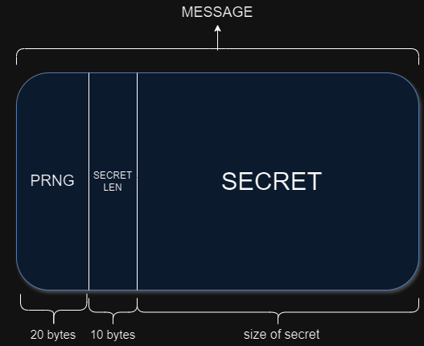
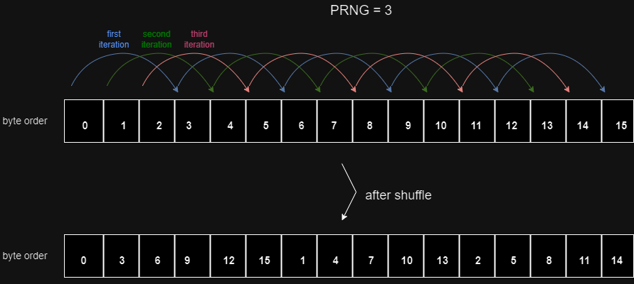

# Secure-LSB

Secure-LSB uses a simple LSB steganography technique capable of hiding any secret, including binary data. Secret is part of a message which consists of `[PRNG | LEN OF SECRET | ACTUAL SECRET]`. When embedding the bits of message into the image, AES 256-bit encryption is performed on the secret and then, the secret is shuffled with a PRNG number. 

AES implemention for this tool is based on [Tiny AES C](https://github.com/kokke/tiny-AES-C) project.

### Structure of message:



### Example for shuffling mechanism:



## Compiling the program

```bash
gcc -o Secure-LSB Secure-LSB.c Helper.c AES.c
```

## Examples

With `ICO` format:

```bash
./Secure-LSB hide verysecretkeykeysecret samples/Ico-file-for-testing.ico samples/slick.bin out.ico

./Secure-LSB extract verysecretkeykeysecret out.ico out.bin
```

With `PNG` fornat:

```bash
./Secure-LSB hide verysecretkeykeysecret samples/nature.png samples/slick.bin out.png 

./Secure-LSB extract verysecretkeykeysecret out.png out.bin
```

With `BMP` format:

```bash
./Secure-LSB hide verysecretkeykeysecret samples/example.bmp samples/secret.txt out.bmp

./Secure-LSB extract verysecretkeykeysecret out.bmp out.txt
```

## Known issues & limitations

The key used for encryption and decryption must be a string of characters with no NULL bytes.

The max size of the secret that can be hidden into the image is: `size_of_image / 8 - ( START_IDX + size_of_PRNG + size_of_secret_len)`.

Embedding the message can fail in some cases. Therefore, make sure the output is correct by inspecting its content.

Embedding messages can results in corrupted images if a non-standard (or non-default) compression is used.

Shuffling and embedding use very basic techniques which can be improved with more advanced algorithms.
